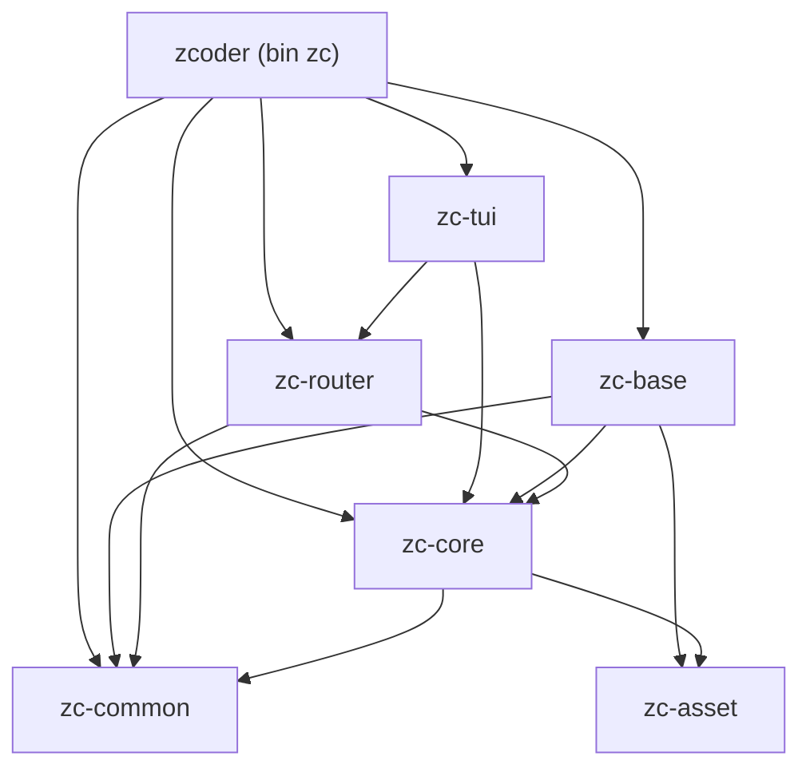

# zcoder Architecture Overview

## Intent

- Single entry point document for the `zcoder` architecture. Read this first to get the overall picture.

- Summarizes the Cargo workspace, the crate taxonomy, the dependency direction, the runtime flow, and the shared event contracts.

- Also covers the root binary crate `zcoder` (bin `zc`): CLI surface, `base` subcommand, startup orchestration, debug logging, and error model.

- Then drill into the crate specific specs for detail:

  - `dev/specs/spec-zc-common.md`: shared pure types and small utilities.
  - `dev/specs/spec-zc-core.md`: shared data types and event contracts.
  - `dev/specs/spec-zc-router.md`: Core message contract and routing.
  - `dev/specs/spec-zc-base.md`: database, model, executor, config, prompts, and the Core-facing loops.
  - `dev/specs/spec-zc-tui.md`: terminal UI overview, module boundaries, lifecycle, and runtime flow.
  - `dev/specs/spec-zc-tui-core.md`: TUI core runtime, events, app state, and event handling.
  - `dev/specs/spec-zc-tui-view.md`: TUI layout, section views, styles, and render helpers.
  - `dev/specs/spec-zc-asset.md`: embedded asset runtime and `.zcoder` workspace materialization.

## Crate Map

The workspace is the root binary `zcoder` (bin `zc`) plus six library crates, arranged in four layers: entry, role, contract, and foundation. Arrows read as "depends on".



The complete dependency set:

```text
zcoder (bin zc)  --> zc-tui, zc-base, zc-core, zc-router, zc-common

zc-tui           --> zc-router (features = ["client"]), zc-core, zc-common (and zc-base, dev only)
zc-base          --> zc-router, zc-core, zc-common, zc-asset
zc-router        --> zc-core, zc-common
zc-core          --> zc-common
zc-common        --> (no domain crates)
zc-asset         --> (no domain crates)
```

## Crate Table

| Crate               | Kind   | What it is for                                                                                                                              |
| ------------------- | ------ | ------------------------------------------------------------------------------------------------------------------------------------------- |
| `zcoder` (bin `zc`) | binary | CLI parsing, startup orchestration, debug logging, and orchestration-level error conversion.                                                |
 | `zc-common`         | lib    | Dependency-light shared utilities: `Id`, `MsgId`, bounded mpsc primitives, time, consts, dirs, jsons, and yaml.                             |
| `zc-core`           | lib    | Shared data types and event contracts only: model types, entity structs plus their derives, `ModelChangeEvent`, `ExecCmd`, and `ExecEvent`. |
 | `zc-router`         | lib    | The Core message contract, wire framing, client handle (`RouterClient`), and listener server (`RouterServer`).                             |
 | `zc-base`           | lib    | The server daemon, owning all data change, persistence (SQLite), executor, prompts, and workspace BMCs.                                      |
| `zc-tui`            | lib    | Terminal UI lifecycle, app state, event handling, and rendering; reaches Core through the router.                                           |
| `zc-asset`          | lib    | Embedded asset runtime used to materialize the `.zcoder` workspace.                                                                         |

## Workspace Layout

```text
Cargo.toml              # root package, bin `zc`, workspace members and shared deps
src/
  main.rs               # startup orchestration
  cmd.rs                # CLI parsing with clap
  base_cmd.rs           # `zc base` daemon server entry point and lifecycle
  error.rs              # root crate error type
crates/
  zc-common/            # shared pure types and small utilities
  zc-core/              # shared data types and event contracts
  zc-router/            # Core message contract and routing
  zc-base/              # database, model, executor, config, prompts, and Core loops
  zc-tui/               # terminal UI runtime, state, and rendering
  zc-asset/             # embedded asset runtime
dev/specs/              # architecture and behavior specs
.zcoder/                # generated runtime dir (config, debug logs, cache)
```

## Dependency Direction

Critical rules:

- `zc-core` never depends on `zc-router` or `zc-base`; it stays the shared types and contracts crate.

- Only `zc-base` opens a SQLite connection or runs SQL.

- `zc-router` is contract and routing only, and never touches the database or the model bus.

- `zc-tui` reaches persisted state only through the router contract, as owned data (`Run`, `Air`, events), never as a handle.

- The root binary depends only on what it wires together: `zc-base`, `zc-router`, `zc-core`, `zc-tui`, and `zc-common`.

Details:

- `zc-tui` depends on `zc-router` for the Core message contract, on `zc-core` for the shared types, and on `zc-common` for channel primitives. It uses `zc-base` only as a dev-dependency, for test seeding.

- `zc-base` depends on `zc-core` for the shared types and contracts, on `zc-router` for the message contract, on `zc-common` for channel primitives and utilities, and on `zc-asset` for workspace asset sync.

- `zc-router` depends on `zc-core` for the shared types and on `zc-common` for channel primitives.

- `zc-core` depends only on `zc-common`.

- `zc-common` and `zc-asset` stay dependency light and never depend on domain crates.

## Root Binary (zcoder)

The root binary (`zcoder`, bin `zc`) acts as both the client entry point and the background server runner:

1. **Default Invocation (`zc [prompt] [--dir <dir>]`)**:
   - Resolves workspace root (`find_wspace_dir`).
   - Sets up debug logging in `<wspace_dir>/.zcoder/debug-log/log.txt`.
   - Connects to `/tmp/zcoder-base.sock` using `RouterClient::uds`.
   - If not running, spawns `zc base` detached, retrying connection with backoff.
   - Starts the TUI (`zc_tui::start_tui`).

2. **Base Subcommand (`zc base`)**:
   - Runs out of `zbase_dir`, defaulting to `~/.config/zcoder-base/`. `ZCODER_BASE_DIR` overrides this location, with relative values resolved from the command's current directory.
   - Sets up debug logging in `<zbase_dir>/debug-log/log.txt`.
   - Connect-probes socket to ensure single-instance exclusivity.
   - Binds `RouterServer` on `/tmp/zcoder-base.sock`.
   - Monitors active connections and shuts down after `BASE_IDLE_GRACE_SECS` when connection count reaches zero.
   - Cleans up socket file on clean exit, `SIGINT`, or `SIGTERM`.

Module layout:

```text
src/
  main.rs   # startup orchestration and tracing setup
  cmd.rs    # CLI parsing with clap
  error.rs  # root crate Error and Result
```

Responsibilities:

- parse command-line input through `CliCmd`

- derive startup configuration values such as the base directory

- build `ZcBaseConfig` from the resolved workspace directory and the optional base directory

- start the base role through `zc_base::InProcBase::start`

- obtain the single `RouterClient` from the base and pass it to `zc_tui::start_tui`

- own only orchestration-level error conversion

- own debug logging setup

The root binary does not own:

- executor workflow logic

- AI provider calls

- file loading or file-change application

- terminal UI state, rendering, or event handling

- shared event data definitions

CLI:

- `CliCmd` in `src/cmd.rs` is parsed with `clap`.

- It exposes an optional `prompt` positional and an optional `--dir` flag.

Dependencies:

- `zc-base`: starts the base role (Core initialization and the router loop) and owns the executor error.

- `zc-tui`: owns the terminal UI lifecycle and the interactive loop.

- `zc-core`: shared model types and event contracts.

- `zc-router`: the Core message contract used at the frontend boundary.

## Startup Sequence

```text
root main (zc)
  -> parse CLI
  -> if command == Some(SubCmd::Base) -> run_base_cmd()
  -> resolve wspace_dir via find_wspace_dir(&from_dir)
  -> init tracing to wspace_log_file(&wspace_dir)
  -> connect_or_spawn(/tmp/zcoder-base.sock, client_info)
       -> RouterClient::uds connect probe
       -> if offline: spawn detached `current_exe() base` and retry with backoff
       -> Attach handshake: send ClientInfo, receive AttachOk(wspace_id)
  -> zc_tui::start_tui(router_client, cli_cmd.prompt).await
```

## Shared Constants

All path names, directory markers, socket paths, and timeouts are centralized in `zc-common::consts`:
- `BASE_SOCK_PATH`: `/tmp/zcoder-base.sock`
- `ZBASE_DIR_NAME`: `zcoder-base`
- `CONFIG_DIR_NAME`: `.config`
- `WKS_MARKER_DIR_NAME`: `.zcoder`
- `BASE_IDLE_GRACE_SECS`: `5`
- Path helpers live in `zc_common::dirs`.
- `ZCODER_BASE_DIR` optionally overrides `zbase_dir`. It may be absolute or relative to the current working directory of the `zc` command.

## Event Contracts

```rust
// zc-router::msg
pub struct RouterMsg {
    pub msg_id: MsgId,
    pub wspace_id: Id,
    pub data: RouterMsgData,
}

pub enum RouterMsgData {
    ModelRpcReq(ModelRpcReq),
    ModelRpcRes(ModelRpcReply),
    ModelChange(ModelChangeEvent),
    Exec(ExecCmd),
    ExecEvent(ExecEvent),
    Attach(ClientInfo),
    AttachOk(Id),
    AttachErr(String),
}

// zc-core::exec
pub enum ExecCmd {
    RunPrompt(String),
}

pub struct ExecReq {
    pub wspace_id: Id,
    pub cmd: ExecCmd,
}

pub enum ExecEvent {
    RunStart(Id),
    RunEnd(Id),
    RunError(Id),
}

// zc-core (types and contracts)
pub struct ModelChangeEvent {
    entity: EntityType,   // Run, Aixc, ...
    action: EntityAction, // Created, Updated, ...
    id: Option<Id>,
    rel_ids: RelIds,      // includes wspace_id: Option<Id>
}

// zc-tui::core
pub enum TuiEvent {
    Term(Event),
    Action(AppActionEvent),
    Exec(ExecEvent),
    Model(ModelChangeEvent),
    Tick(i64),
    DoRedraw,
}

pub enum AppActionEvent {
    Quit,
    RunPrompt(String),
}
```

- Executor command and event channels are aliased as `ExecCmdTx`/`ExecCmdRx` and `ExecEventTx`/`ExecEventRx`.

- Model RPC requests and replies use `ModelRpcReq` and `ModelRpcReply`, correlated by `msg_id` on `RouterMsg`.

- All UI signals share one `TuiEvent` stream so terminal input, actions, executor status, model changes, and ticks stay ordered in the UI loop.

## Runtime Flow

```text
CLI parse (zcoder)
  -> connect_or_spawn(/tmp/zcoder-base.sock) -> RouterClient::uds
  -> zc_tui::start_tui(router_client, ...)
       -> tui_impl: ratatui init, TuiEvent channel, model event loop,
                    exec event loop, terminal reader, ping timer
       -> tui_loop: draw -> recv TuiEvent -> debounce -> handle
```

Action flow across processes:

```text
Terminal input -> TuiEvent::Term  -> tui_event_handlers
App intent     -> TuiEvent::Action -> state + RouterClient -> [UDS wire] -> RouterServer -> base
Base           -> event fanout -> client_filter(wspace_id) -> [UDS wire] -> RouterClient -> TuiEvent::Exec / Model -> state update
```

## Execution Pipeline

The `RunPrompt` path spans the TUI, the router, and `zc-base`.

1. The user presses `Enter` in the prompt view, and the TUI emits `AppActionEvent::RunPrompt(prompt)`.

2. The TUI handler marks the state as running and routes the intent to `zc-base` through the router.

3. `handle_run_prompt` in `zc-base` creates a `Run` row and emits `ExecEvent::RunStart(run_id)`.

4. Workspace assets are re-synced and the config is hot reloaded before each run.

5. The model is resolved from the explicit model, or from `[maestro] model` through `get_model`, and the base directory is resolved from `--dir`, `[workspace] working_dir`, or `wspace_dir`.

6. The user prompt is appended to the base chat request, and `exec_air_chat` performs the provider call while recording an `Air` row with timing, tokens, and cost.

7. Raw request and response payloads are cached to `.zcoder` cache files for inspection.

8. The response text is parsed for UDIFFX file changes, which are extracted and applied to the base directory.

9. The remaining text is parsed for `<AIPROG>` Lua scripts, which run through the AIPROG script engine with a directory context scoped to the base directory.

10. Script results and remaining text are combined into the final answer.

11. The `Run` row is updated with the answer and end state, and `ExecEvent::RunEnd(run_id)` is emitted.

12. On failure, the `Run` row is updated with the error and `ExecEvent::RunError(run_id)` is emitted.

13. `ModelChangeEvent` values emitted during the run drive the TUI work info display, such as model name, elapsed time, tokens, and cost.

## Data and State

- Persistence uses SQLite through `rusqlite`, and all database access lives in `zc-base`.

- `ModelManager` is a process wide singleton created with `OnceLock` and exposed through `get_model_manager()` in `zc-base`.

- Entities include runs (`RunBmc`) and AI exchanges (`AirBmc`). The `Aixc` entity type maps to AI exchange rows in model events.

- The entity structs and the event contracts live in `zc-core`; the `Db`, the CRUD support, and the `RunBmc`/`AirBmc` accessors live in `zc-base`.

- Model change events are published on entity changes and forwarded to the TUI as `TuiEvent::Model`.

- TUI state is a pure render model: input buffer, waiting flag, status text, last prompt, last answer, last error, scroll positions, and optional system metrics.

## Logging

- Debug tracing is written to `.zcoder/debug-log/log.txt` through a non-blocking file appender.

- The tracing subscriber is configured with an `EnvFilter` that enables `debug` for the application crates.

- The non-blocking guard is kept alive for the process lifetime so buffered logs are flushed.

## Error Ownership

- Each crate owns its own `Error` and `Result`.

- `zc-common::Error` covers shared utility failures and is not a workspace wide error.

- `zc-core` mostly exposes plain types; any type-level failure is local to `zc-core`.

- `zc-router` owns the message contract errors, including `ModelRpcError` for a failed model RPC.

- `zc-base` owns the executor, config, provider, filesystem, database, model, and file change application errors.

- `zc-tui::Error` covers terminal, UI, and lifecycle failures.

- The root binary owns only orchestration-level conversion in `src/error.rs`:

  - `Custom`

  - `SimpleFs`

  - `ZcBase(zc_base::exec::Error)`

  - `ZcTui(zc_tui::Error)`

- Errors are converted at the crate boundary where they originate.

## Design Considerations

- The workspace is split by runtime responsibility rather than by technology, so the base and the TUI can evolve independently.

- A thin root binary makes startup easy to audit and prevents domain behavior from accumulating in the binary crate.

- A narrow `zc-common` avoids creating a large shared dependency that every crate must accept.

- `zc-core` is types and contracts only, so the compiler can enforce the boundary: no crate reaches SQLite through it.

- Only `zc-base` opens a connection, so the database has a single home and the later process split stays a transport swap.

- One app event stream in the TUI keeps terminal input, actions, executor status, model events, and ticks consistently ordered.

- The base boundary keeps long running work, AI calls, and file changes out of the UI loop.

- The asset runtime keeps workspace `.zcoder` state reproducible while preserving user edits.

- The module structure is intentionally modular so navigation, scrolling, popups, and richer run views can be added without turning `tui_loop.rs` or `main_view.rs` into catch all files.
